<p align="center">
  
</p>

<h1 align="center">AmmarOS</h1>

<p align="center">
  <strong>A developer portfolio that behaves like a personal operating system.</strong>
</p>

<p align="center">
  Boot through an authentic GRUB environment, choose a Windows or macOS workspace, and explore Muhammad Ammar Asad's work through native desktop applications and a VS Code-inspired portfolio editor.
</p>

<p align="center">
  
  
  
  
</p>

<p align="center">
  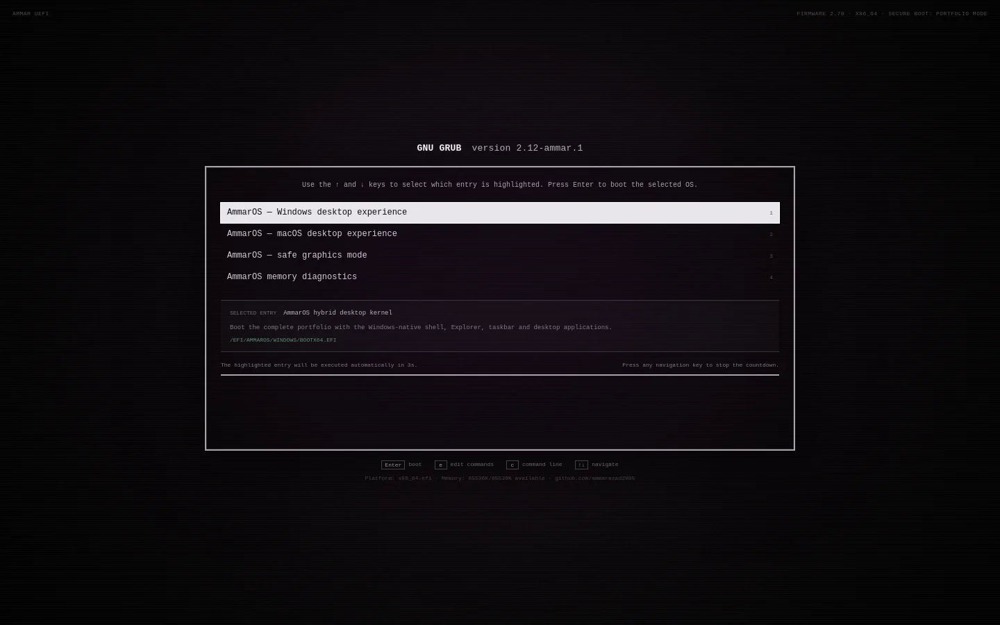
</p>

---

## The concept

Most portfolios present a sequence of pages. AmmarOS presents a **place**.

The experience begins before the portfolio is visible. A firmware-inspired preboot frame hands control to a functional GNU GRUB interface. The visitor chooses the operating-system language they prefer, watches that environment sign in, and arrives at a desktop whose applications represent different parts of Muhammad Ammar Asad's professional story.

This is not a static operating-system illustration. Windows, macOS, Android, and iOS have independent shells, interaction patterns, navigation models, applications, wallpapers, and system controls. The same portfolio content is expressed through the conventions of the selected platform.

> **Progressive enhancement is the rule:** the cinematic desktop is optional, every introduction is skippable, reduced motion is respected, and mobile receives a purpose-built portfolio rather than a compressed desktop metaphor.

---

## Two native desktop languages

<table>
  <tr>
    <td width="50%" valign="top">
      <h3 align="center">Windows workspace</h3>
      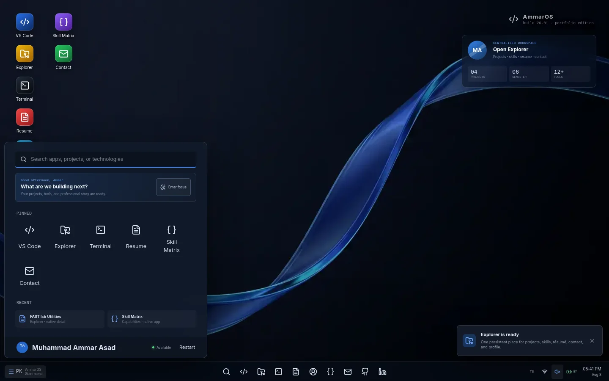
      <p>PK Start area, searchable Start menu, taskbar, Explorer, Windows window controls, PowerShell behavior, system tray, focus controls, and movable desktop shortcuts.</p>
    </td>
    <td width="50%" valign="top">
      <h3 align="center">macOS workspace</h3>
      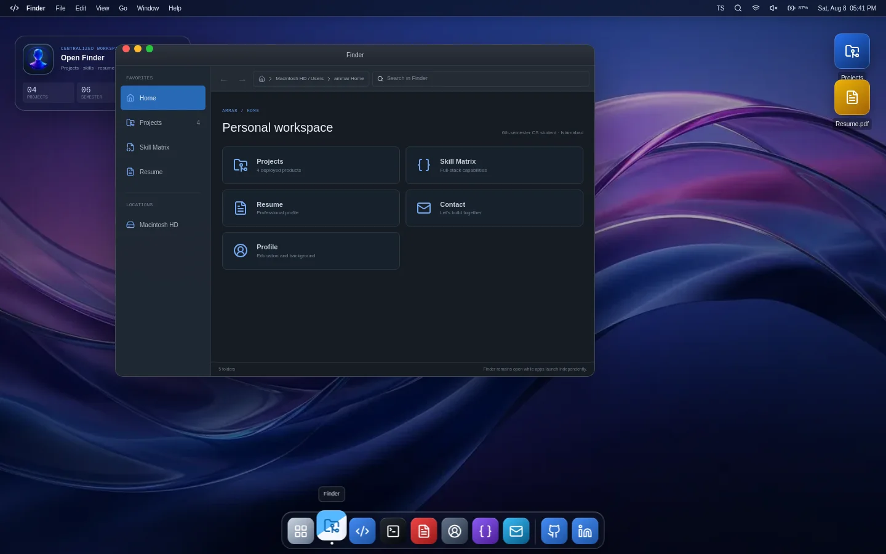
      <p>Dedicated wallpaper, menu bar, Dock, Finder, Launchpad, Spotlight, traffic-light controls, zsh behavior, Preview, Mail, System Settings, and native desktop context menus.</p>
    </td>
  </tr>
</table>

<table>
  <tr>
    <td width="50%" valign="top">
      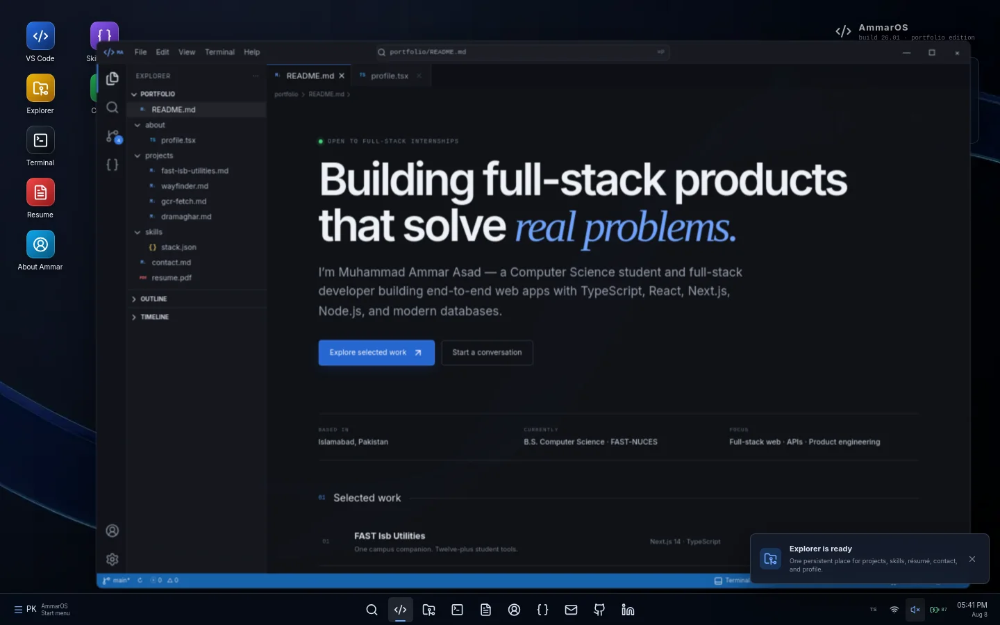
    </td>
    <td width="50%" valign="top">
      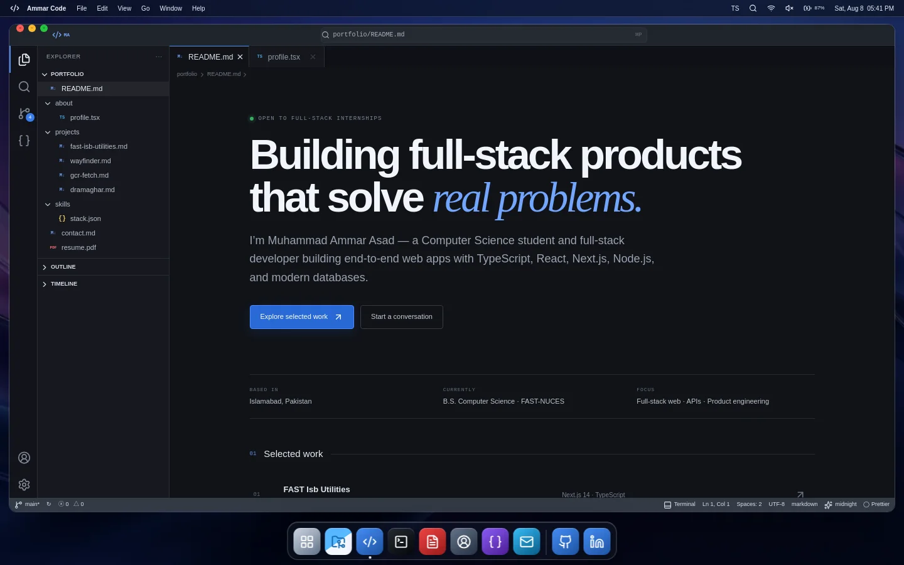
    </td>
  </tr>
</table>

---

## Two native mobile languages

<table>
  <tr>
    <td width="50%" valign="top">
      <h3 align="center">Android workspace</h3>
      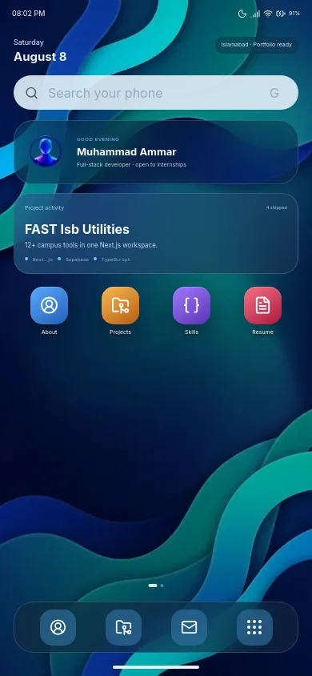
      <p>Material You wallpaper, At a Glance, profile and project widgets, app drawer, notification shade, quick settings, Android navigation controls, and a persistent favorites dock.</p>
    </td>
    <td width="50%" valign="top">
      <h3 align="center">iOS workspace</h3>
      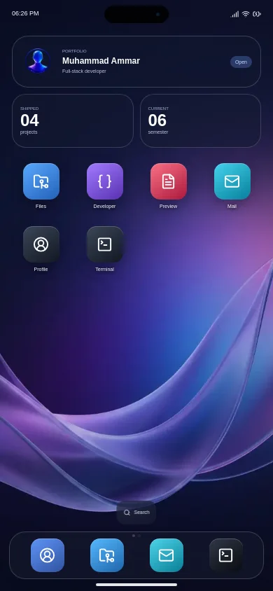
      <p>Dynamic Island, Home Screen widgets, native app grid, Spotlight, Control Center, translucent Dock, Files, Preview, Mail, and a platform-specific terminal.</p>
    </td>
  </tr>
</table>

<p align="center">
  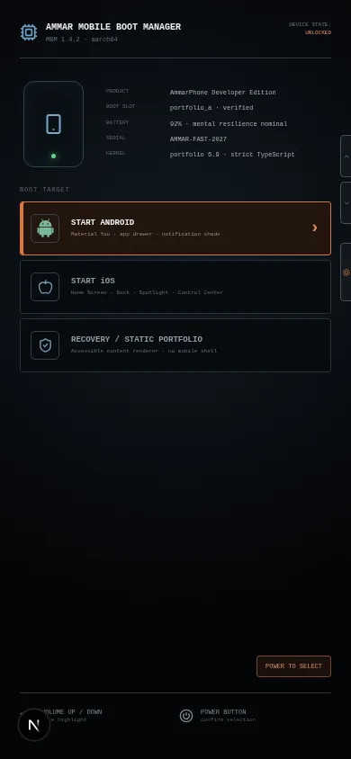
</p>

The mobile entrance mirrors a real unlocked-device boot manager: Volume Up and Volume Down move the highlighted target, while the Power button confirms Android, iOS, or Recovery mode.

---

## Experience flow

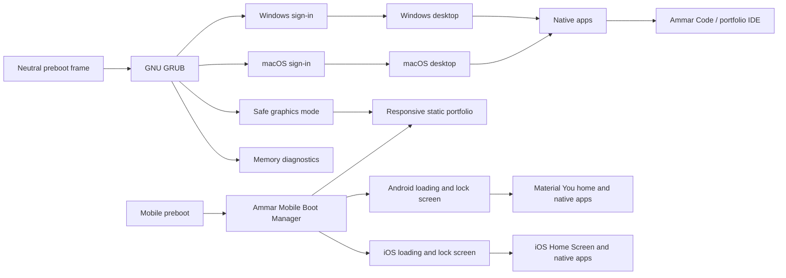

### 1. Firmware and GRUB

The bootloader is a working interaction surface—not a timed animation.

- Arrow keys navigate entries
- `Home` and `End` jump through the menu
- Number keys `1–4` directly select entries
- `Enter` boots the highlighted entry
- `e` opens an editable kernel/EFI command buffer
- `c` opens a functional GRUB command line
- Navigation pauses automatic boot
- `Ctrl + X` or `F10` boots an edited entry
- `Esc` returns to the previous boot surface

The GRUB console supports `help`, `ls`, `set`, `version`, `clear`, `boot`, and `exit`.

### 2. Platform sign-in

Each platform receives a separate transition:

- Windows uses the AmmarOS system mark and workspace loading state
- macOS uses a dedicated wallpaper, illustrated developer account, status indicator, and native progress treatment
- The intro can always be skipped
- Reduced-motion visitors receive a shortened, non-animated transition

<p align="center">
  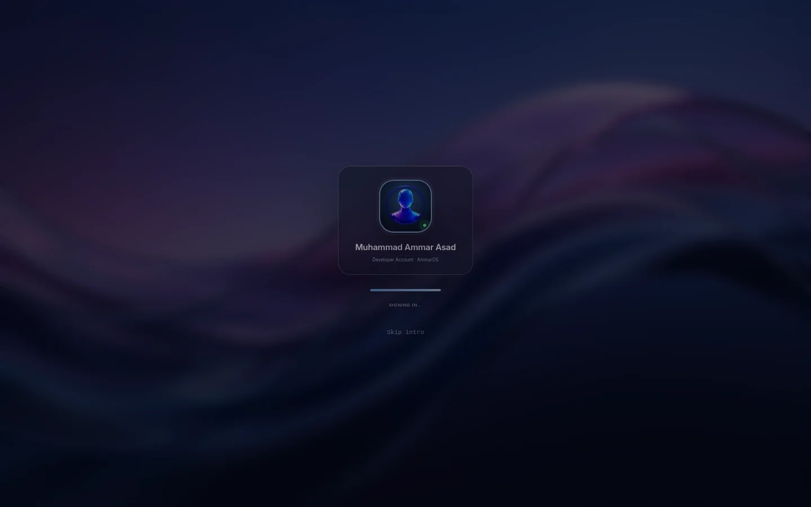
</p>

### 3. Desktop exploration

Desktop shortcuts use native single-click selection and double-click launch behavior. They can be moved freely, selected together with `Ctrl`/`Cmd`, or captured with a left-drag marquee. Positions persist independently for Windows and macOS.

Opening another application does not close Explorer or Finder. Every window remains available until the visitor explicitly minimizes or closes it.

### 4. Native applications

| Application | Windows presentation | macOS presentation | Purpose |
|---|---|---|---|
| Central files | Explorer | Finder | Persistent access to projects, skills, résumé, contact, and profile |
| Code portfolio | Ammar Code | Ammar Code | VS Code-inspired file and content workspace |
| Shell | PowerShell | zsh Terminal | Personalized commands and application launching |
| Résumé | Resume Viewer | Preview | High-resolution résumé with original PDF access |
| Contact | Contact | Mail | Editable message and native mail-client handoff |
| Skills | Skill Matrix | Developer Profile | Capability categories tied to shipped work |
| Profile | About Ammar | System Settings | Education, principles, availability, and environment |

### 5. Ammar Code

The IDE is the most detailed content layer:

- Activity bar and file explorer
- Persistent multi-tab editor
- Markdown-style portfolio rendering
- Syntax-highlighted code with line numbers
- Project case studies
- Command palette with `Cmd/Ctrl + P`
- Integrated terminal with `Cmd/Ctrl + backtick`
- Theme persistence
- Printable and downloadable résumé access

---

## Navigation behavior

### Windows

- The **PK area** is the Start control
- Start searches applications, projects, and technologies
- Taskbar icons focus, restore, or minimize their applications
- Right-clicking the desktop opens Windows-specific commands
- Developer Zone controls mental resilience, noise shielding, session intent, and focus state
- The clock opens a calendar and builder rhythm panel

### macOS

- **Launchpad** is the application browser and Start-menu equivalent
- **Spotlight** opens from the menu bar or `Cmd + Space`
- Finder is the persistent centralized navigation application
- Dock indicators show running applications
- Right-clicking uses macOS commands such as New Finder Window, Get Info, Clean Up, Change Desktop Picture, and Show View Options
- Desktop picture and icon-size controls only affect macOS

### Mobile

Below the desktop breakpoint, AmmarOS enters a dedicated mobile boot manager instead of shrinking the desktop interface.

#### Mobile boot manager

- Volume Up and Volume Down move through boot targets
- The simulated Power button confirms the highlighted target
- Keyboard volume and arrow keys work for testing and accessibility
- Android, iOS, and Recovery/static modes are available

#### Android

- Material You home screen and dedicated wallpaper
- At a Glance date and Islamabad workspace status
- Native profile and featured-project widgets
- Searchable app drawer
- Notification shade and quick settings
- Focus Zone, noise shielding, builder network, and resilience controls
- Android Back, Home, and Recents navigation

#### iOS

- Dedicated iOS wallpaper, status bar, and Dynamic Island
- Home Screen widgets and native app grid
- Translucent iOS Dock
- Spotlight-style application search
- Control Center with connectivity, focus, sound, brightness, and resilience
- Native Files, Developer, Preview, Mail, Profile, and Terminal applications

Both platforms include lock screens, swipe/touch unlocking, full-screen native applications, projects, skills, résumé preview, contact flow, social links, and a functional mobile terminal.

---

## Technology stack

| Layer | Technology | Responsibility |
|---|---|---|
| Framework | **Next.js 15 App Router** | Routing, metadata, static generation, production build, Vercel runtime |
| Interface | **React 19** | Stateful desktop, applications, IDE, bootloader, and mobile UI |
| Language | **TypeScript** | Typed application state, portfolio content, platform models, and component contracts |
| Styling | **Tailwind CSS 4 + custom CSS** | Design tokens, native platform treatments, responsive behavior, print and motion modes |
| Motion | **Framer Motion** | Window transitions, dragging, Dock behavior, overlays, tabs, and progressive enhancement |
| Icons | **Lucide React** | Consistent system and application iconography |
| Images | **Next Image** | Optimized wallpapers, résumé preview, and account artwork |
| Quality | **ESLint + TypeScript** | Static analysis and strict type checking |
| Delivery | **Vercel + GitHub Actions** | Deployment, pull-request validation, and production hosting |

### Why client-render the OS shell?

The desktop depends on browser-only capabilities such as `window`, `matchMedia`, `localStorage`, pointer capture, drag coordinates, and keyboard shortcuts. Next.js still statically generates the route shell, while the operating-system experience loads through an explicit client boundary. The neutral preboot fallback exactly matches GRUB's background, preventing hydration or platform-specific flashes.

---

## Persistence and state

AmmarOS keeps useful preferences without turning restoration into a barrier:

- Open IDE tabs
- Active theme
- Windows desktop icon positions
- macOS desktop icon positions
- Platform-specific desktop arrangement

The selected operating system is intentionally **not** persisted—the GRUB decision appears on every full visit.

---

## Accessibility and performance

- Complete keyboard operation for GRUB, IDE, terminal, menus, tabs, and dialogs
- Visible focus treatment
- Semantic buttons, labels, dialogs, tabs, and status regions
- `prefers-reduced-motion` handling
- Skippable introduction
- Mobile-specific rendering path
- Optimized WebP screenshots and wallpapers
- Static Next.js route generation
- Client-only loading limited to the interactive desktop shell
- No obsolete Vite bundle or duplicate local build output

---

## Screenshot gallery

<table>
  <tr>
    <td>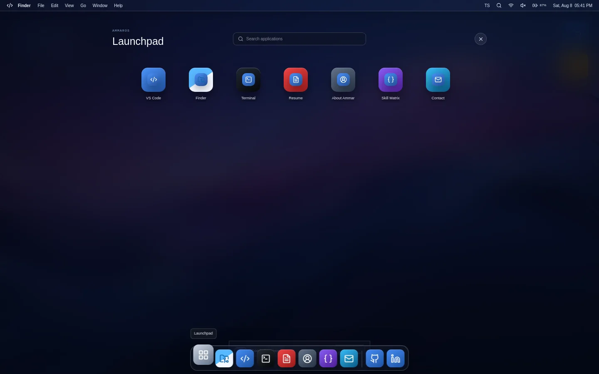</td>
    <td></td>
  </tr>
  <tr>
    <td align="center"><strong>Launchpad</strong></td>
    <td align="center"><strong>Finder</strong></td>
  </tr>
</table>

<table>
  <tr>
    <td>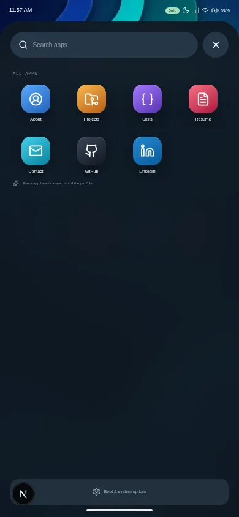</td>
    <td>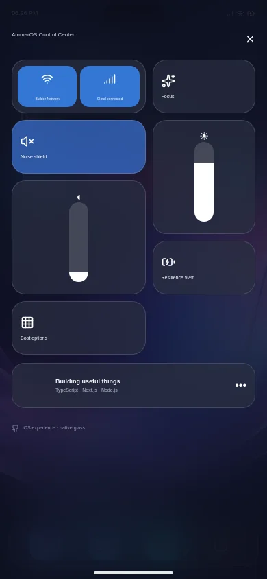</td>
  </tr>
  <tr>
    <td align="center"><strong>Android app drawer</strong></td>
    <td align="center"><strong>iOS Control Center</strong></td>
  </tr>
</table>

---

## Local development

### Requirements

- Node.js 20+
- npm 10+

### Install and run

```bash
npm install
npm run dev
```

The development command removes obsolete Vite output before starting Next.js, preventing local preview tools from serving a retired bundle.

### Validate

```bash
npm run lint
npm run typecheck
npm run build
```

### Production

```bash
npm run start
```

---

## Project structure

```text
app/
├── client-portfolio.tsx      # Client-only OS boundary
├── layout.tsx                # Metadata, viewport and global styles
└── page.tsx                  # Statically generated route

src/
├── components/
│   ├── AccountAvatar.tsx     # Platform-aware account artwork
│   ├── BootSequence.tsx      # GRUB, editor, console and sign-in states
│   ├── ContentRenderer.tsx   # Portfolio documents and résumé preview
│   ├── DesktopShell.tsx      # Windows/macOS shells and system controls
│   ├── DesktopShortcuts.tsx  # Dragging, persistence and marquee selection
│   ├── IDEWorkbench.tsx      # VS Code-inspired portfolio application
│   ├── MobilePortfolio.tsx   # Recovery/static mobile experience
│   ├── NativeDesktopApps.tsx # Finder/Explorer, Terminal, Mail and more
│   └── mobile/
│       ├── MobileExperience.tsx # Mobile boot manager, loading and lock screens
│       ├── AndroidShell.tsx     # Material You home, drawer and notification shade
│       ├── IOSShell.tsx         # iOS Home Screen, Spotlight and Control Center
│       └── MobileAppContent.tsx # Shared native mobile applications
├── data/
│   ├── nativeApps.ts         # Native application registry
│   └── portfolio.ts          # Projects and portfolio file tree
├── App.tsx                   # Experience state machine
├── index.css                 # Platform design systems and responsive rules
└── types.ts                  # Shared application types

public/
├── screenshots/              # README captures from the deployed website
├── downloads/                # Downloadable résumé
├── ammar-avatar.png
├── resume-preview.png
├── wallpaper.webp
├── wallpaper-macos.webp
└── mobile/
    ├── android-wallpaper.webp
    └── ios-wallpaper.webp
```

---

## Updating portfolio content

Most portfolio content is intentionally centralized:

- Edit projects in `src/data/portfolio.ts`
- Edit application labels in `src/data/nativeApps.ts`
- Edit rendered documents in `src/components/ContentRenderer.tsx`
- Replace résumé assets in `public/`

---

<p align="center">
  <strong>Built as software, presented as a portfolio.</strong>
</p>

<p align="center">
  Muhammad Ammar Asad · Full-Stack Web Developer · FAST-NUCES Islamabad
</p>
